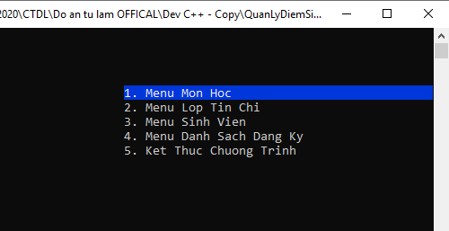
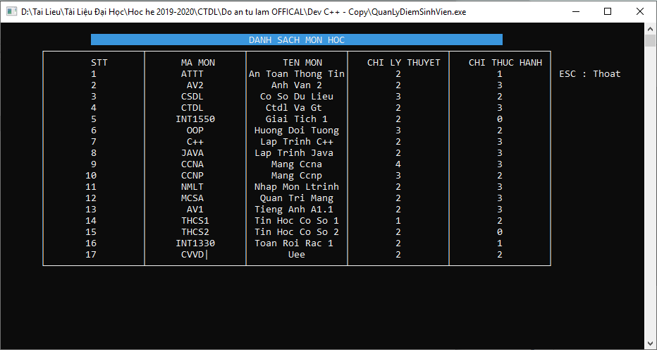
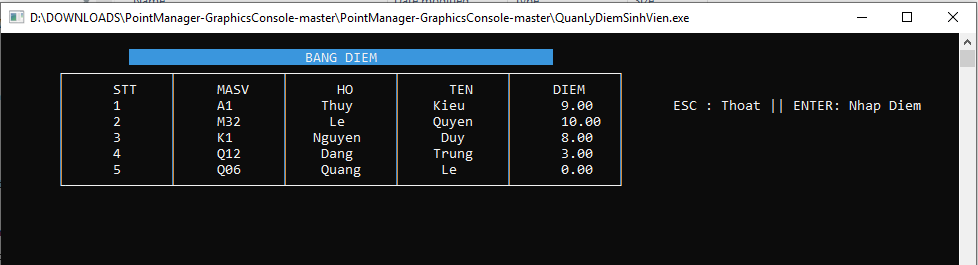
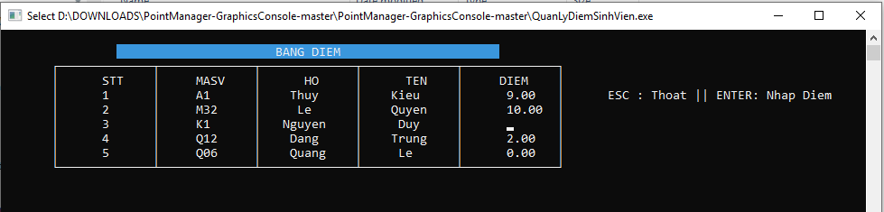
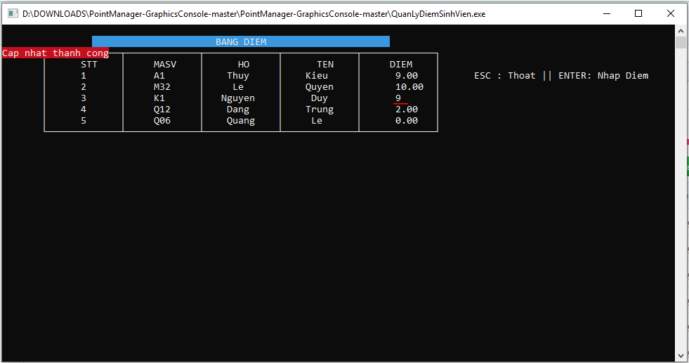
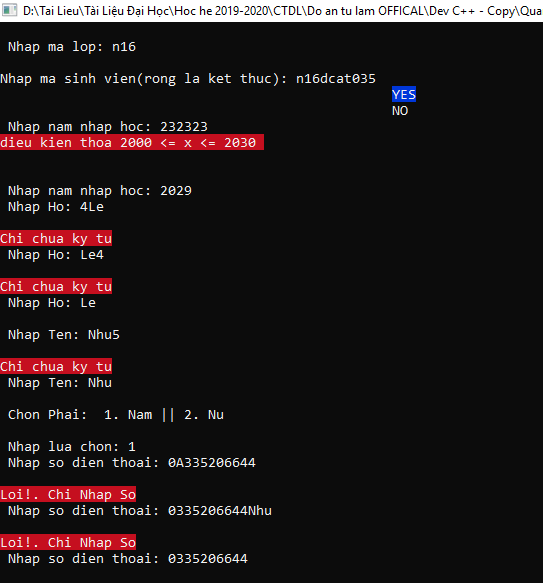

I built this project when I was a 3rd-year student

## PointManager-GraphicsConsole
### Tutorial run application Quickly
#### B1: Download file zip
#### B2: run file "QuanLyDiemSinhVien.exe"
#### require: pc must have installed devC++
## Tracking-app-console

### Screen Subject List

### List point table

### Screen edit point

### update point 

### Add Student

